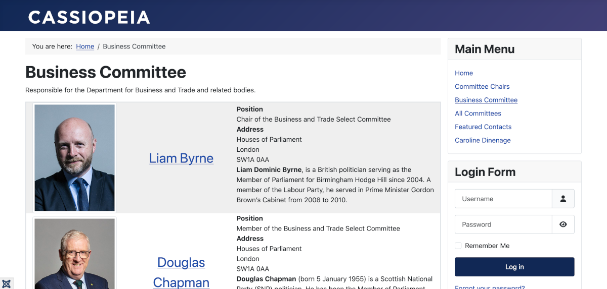

<!-- Filename: category-list-override.md / Display title: Category List Override -->

## The List Contacts in a Category Menu Item

It may be a personal opinion, but for me the default Contact category list
layout is not quite satisfactory. My problems:

* The contact photos are too large at just under 500 pixels wide.
* The contact name is not sufficiently emphasised.
* The personal details bullet list has no heading and looks isolated.
* The Position has no heading so could seem isolated.
* The address and post code fields are absent
* The location data is incomplete.
* The personal statement is missing.
* The list is laid out in a table which is a little better on narrow screens
but rather cramped.

So how to fix it to my liking?

## Styling

The image has CSS style `contact-thumbnail img-thumbnail`. The browser
Developer Tools indicate that img-thumbnail is set to `max-width: 100%;`
but contact-thumbnail is not used. The only occurrence of the latter style
in the entire site is in this location so it seems safe to set an override in
user.css to restrict the image width. And the contact name font size can be
increased using its enclosing `a` tag:

```
.contact-thumbnail {
  max-width: 200px;
  margin-right: 1rem;
}
a:has(.contact-thumbnail) {
  font-weight: 700;
  font-size: larger;
}
```
The bullet list of custom fields can be improved by removing the bullets and
padding by selecting only bullet lists that appear within a tag that has a
class of contactList:
```
#contactList ul {
  list-style-type: none;
  padding-left: 0;
}
```


That is as much as can be done with styling. Better but still not good enough.
To add more items and change the layout will require a layout override.

## Template Layout Override

The com_contact/tmpl/category folder has three PHP files: default.php,
default_children.php and default_items.php. The last in this list contains
the table layout for the list.

The override files are created via System / Site Templates / Cassiopeia
Details and Files / Create Overrides. Select com_contact and then category.
The html folder then contains com_contact/category with the three template
files mentioned above. The default_items.php is the one to select for
editing. Lines 83 to 203 contain the table used for layout.

It may not be obvious but $this->items is an array of category members and
each member actually contains all of the data for each item, not just those
mentioned in the menu settings.

The following is a replacement for the `<table>...</table>` section of the
default_items.php file using a Bootstrap grid. On narrow screens the three
columns are stacked. On screens wider than 768 pixels the columns are side
by side. More explanation follows the code.

```
<div class="container-fluid text-center border border-2">
<?php $nrows = 0; foreach ($this->items as $i => $item) : ?>
    <?php if ($item->published !== 1 ||
        (!empty($item->publish_up) && strtotime($item->publish_up) > strtotime(Factory::getDate())) ||
        (!empty($item->publish_down) && strtotime($item->publish_down) < strtotime(Factory::getDate()))) { continue; } ?>
        <div class="row cat-list-row<?php echo $nrows % 2; $nrows += 1; ?> align-items-center">
            <div class="col-12 col-md-3">
                <?php if ($this->params->get('show_image_heading')) : ?>
                    <?php if ($item->image) : ?>
                        <?php echo LayoutHelper::render(
                            'joomla.html.image',
                            [
                                'src'   => $item->image,
                                'alt'   => 'official image of ' . $item->name,
                                'class' => 'contact-thumbnail img-thumbnail',
                            ]
                        ); ?>
                    <?php endif; ?>
                <?php endif; ?>
            </div>
            <div class="col-12 col-md-3">
                <a href="<?php echo Route::_(RouteHelper::getContactRoute($item->slug, $item->catid, $item->language)); ?>">
                    <span class="fs-2"><?php echo $this->escape($item->name); ?></span>
                </a>
            </div>
            <div class="col-12 col-md-6 text-start">
                <?php if ($this->params->get('show_position_headings') && !empty($item->con_position)) : ?>
                    <strong>Position</strong><br>
                    <?php echo $item->con_position; ?><br>
                <?php endif; ?>
                <?php if ($this->params->get('show_suburb_headings')) : ?>
                    <?php $location = []; ?>
                    <?php if (!empty($item->address)) : ?>
                        <?php $location[] = $item->address; ?>
                    <?php endif; ?>
                    <?php if (!empty($item->suburb)) : ?>
                        <?php $location[] = $item->suburb; ?>
                    <?php endif; ?>
                    <?php if (!empty($item->state)) : ?>
                        <?php $location[] = $item->state; ?>
                    <?php endif; ?>
                    <?php if (!empty($item->postcode)) : ?>
                        <?php $location[] = $item->postcode; ?>
                    <?php endif; ?>
                        <strong>Address</strong><br>
                    <?php echo implode("<br>\n", $location); ?><br>
                <?php endif; ?>
                <?php if (!empty($item->misc)) : ?>
                    <?php echo $item->misc; ?>
                <?php endif; ?>
            </div>
        </div>
    <?php endforeach; ?>
</div>
```
### Explanation

The contacts list may contain items that are not published, or have publish_up
and publish_down dates that are not current. They need to excluded from
display and a separate counter is needed to keep the alternation of background
colours in each row.

The img tag is rendered as:
```

```
The `<span class="fs-2">...</span>` class sets the contact name to font size 2,
which would be the same as Heading 2.

The `show_suburb_headings` item is being used as a proxy to show the whole
address as some of the individual address items do not have Show/Hide
selectors in the menu item.

### Extra Styling

The gridded version of the contact list needs additional styling in user.css:
```
.contact-thumbnail {
  max-width: 200px;
  margin-right: 1rem;
}

a:has(.contact-thumbnail) {
  font-weight: 700;
  font-size: larger;
}

#contactList ul {
  list-style-type: none;
  padding-left: 0;
}

.cat-list-row0 {
  background-color: #efefef;
}

.cat-list-row0:hover, .cat-list-row1:hover  {
  background-color: #ddd;
}
```

### Result


