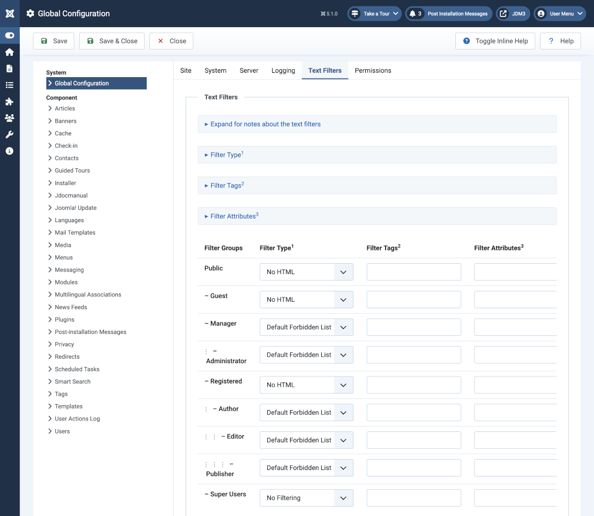

<!-- Filename: Entering_raw_HTML_in_editors / Display title: HTML Filters -->

## HTML Textarea Tag

In HTML a multi-line input field is known as a textarea. Any text between the
opening and closing tags is displayed as text that may contain HTML markup.
Example:
```
<textarea><p class="poem">The quick brown fox<br>
jumps over the lazy dog.</textarea>
```
Editors, such as TinyMCE or Code Mirror use JavaScript to overlay the textarea
with a different display to allow WYSIWYG data entry and or syntax
highlighting. The Toggle button beneath an editor field toggles between the
textarea view and the WYSIWYG view.

Editor views are used for the content of Articles and some Modules. However,
you need to be aware that not all HTML tags and attributes (such as
class="xyz") are allowed to all users. Some or all may disappear when you
save the content of a textarea or edit field.

This is caused by filtering mechanisms, either in the Joomla! Global
Configuration or in the editor configuration. An editor filter can be
bypassed by selecting No Editor in your User Profile settings. You cannot
bypass the global filters but you can change them to suit the purposes of
your site.

## User Editor Selection

You can select one of the available editors, including None, from your User
Profile available via the User Account / Edit Profile menu at the top right of
the Administrator screen. The Edit: Profile form contains a Basic Settings
tab with a field to select an Editor. It is normally set to `- Use Default -`,
which is usually TinyMCE. You can select `Editor None`. That will bypass any
filtering of HTML tags and attributes not allowed by TinyMCE configuration
settings.

**Warning:** if you select `Editor - None` to create content containing HTML
tags disallowed by an editor filter and then switch back to the default editor
you should be careful not to edit and save that content again or you will lose
any filtered tags and attributes. It is easy to do this by mistake and there
is no warning.

## Global Configuration: Text Filters

From the Home Dashboard select Global Configuration and then the Text Filters
tab. The default settings have `No HTML` selected for Guest, Public and
Registered user groups. Any of these groups might have an opportunity
to fill out a text area field, for example in a contact form that seeks
extra information about a problem, so automatic removal of all HTML tags is
usually appropriate. Other groups, except Super Users, are restricted by the
Default Forbidden List. Super Users have no filtering.



The notes explain what is included in the default forbidden list and how to
use the other lists.

## TinyMCE Configuration for Text Filters

Editors are implemented as Plugins in Joomla. The CodeMirror editor has no text
filter settings. To customise the TinyMCE editor find and select it in the
list of plugins. Half way down the long list of settings you will see a field
labelled *Use Joomla Text Filter* which is **Off** by default. The next three
fields are
* **Prohibited Elements** a list of tags that will always be removed. The
default list of *script,applet,iframe* all have security concerns.
* **Valid Elements** use this list to limit valid tags to a subset of all
common HTML tags. Example: `a[href|target=_blank],strong/b,div[align],br`
* **Extended Valid Elements** use this list to add an element to the existing
default ruleset or to modify an element in the default ruleset. Example:
`img[class|src|border=0|alt|title|hspace|vspace|width|height|align|onmouseover|onmouseout|name]`

See the TinyMCE Documentation for more explanation.

To bypass the TinyMCE text filters and use Joomla text filters set *Use Joomla
Text Filter* to **On**. The three additional fields described above disappear
as they are not used.
