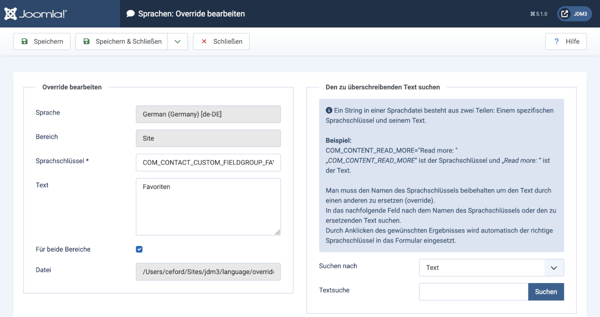
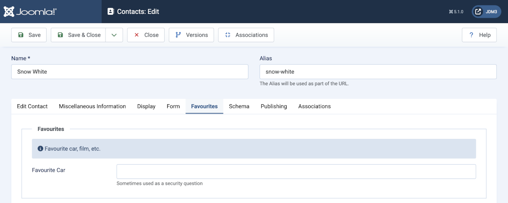
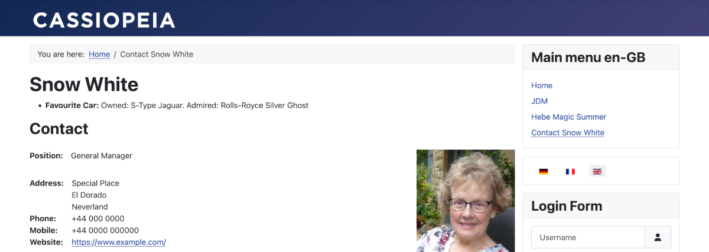

<!-- Filename: J3.x:Adding_custom_fields/Multilingual_Sites / Display title: Multilingual Sites -->

## Introduction

If you have a multilingual site then you can display the labels and
descriptions of fields and field groups in the user's language. To do this:

1.  Define the Title and Description of your field group as language constants.
2.  Define the Label and Description of your field as language constants.
3.  Set up those language constants as overrides for each of your languages.

In the following example a Contact field group and field are creaated for a
contact's personal preferences. The field group is named Favourites and  the
exmple field is named Car. Clearly, more fields can be added for other
favourite things, such as food or films.

To follow this example it is assumed that you have set up a multilingual site
as described in the [Multilingual Sites](jdocmanual?manual=user&heading=languages&filename=setup-a-multilingual-site.md "Multlingual Sites")
tutorial.

## Language Constants

Language constants are placeholders that are replaced by language values when
a page is rendered. The constants and their values are stored in language
files such as JPATH_SITE/languages/en-GB/com_contact.ini and
JPATH_SITE/administrator/languages/en-GB/com_contact.ini, for the frontend and
backend respectively. By convention, most language constants begin with the
extension name all in upper case, for example COM_CONTACT_...

Language overrides are user defined replacements for existing language
constants and values or entirely new constants and values, as in this example.
They are all stored in single files, one for the Site pages and another for the
Administrator pages:
```
SITE_ROOT/language/overrides/en-GB.override.ini
SITE_ROOT/administrator/language/overrides/en-GB.override.ini
```
It is important to make new user defined language constants unique to avoid
overriding existing constants. For example:

COM_CONTACT_CUSTOM_FIELDGROUP_FAVOURITES="Favourites"
COM_CONTACT_CUSTOM_FIELDGROUP_FAVOURITES_DESCRIPTION="Favourite car, film, etc."
COM_CONTACT_CUSTOM_FIELD_FAVOURITE_CAR="Favourite Car"
COM_CONTACT_CUSTOM_FIELD_FAVOURITE_CAR_DESCRIPTION="Sometimes used as a security question"

If there is anything wrong with the syntax of a language file it will not
be loaded and all of the constants in it may appear in the output pages. And
note that a file is sorted in alphabet order.

## Defining the Overrides

It is important to create English (GB) overrides. Joomla loads en-GB translation
files first and then overwrites the values with a selected language file. This
ensures that users should never see a text constant. If a translated value is
missing then English will appear in the output. This looks strange but it is
better than seeing a quite long constant which usually disrupts layouts.

From the Administrator menu:

* Select **System / Manage panel / Language Overrides**
* Select **English (United Kingdom) - Site** from the *Select Language & Client* list
* Select the **New** button from the Toolbar.
* In the **Language Constant** field enter *COM_CONTACT_CUSTOM_FIELDGROUP_FAVOURITES*
* In the **Text** field enter the value *Favourites*
* Check the **For Both Locations** checkbox. This will cause creation of
overrides for both Site and Administrator pages.
* Select **Save & New** from the *Save * Close* dropdown list.
* Repeat for each of the other required constants.
* Select **Close** after the last entry has been saved.
* Repeat for each of the installed languages.

The following screenshot shows an example of override creation for a German
language constant.



## Defining the Field Group

From the Administrator menu:

* Select the **Components / Contacts / Field Groups** menu item.
* Select the **New** button from the Toolbar.
* In the Title field enter the constant COM_CONTACT_CUSTOM_FIELDGROUP_FAVOURITES
* In the Description field enter the constant COM_CONTACT_CUSTOM_FIELDGROUP_FAVOURITES_DESCRIPTION
* Select **Save & Close** from the Toolbar.

## Defining the Field

To select a favourite car you might provide a dropdown list of cars that you
define, or a dropdown list of cars obtained from a database table, or a list
of radio buttons with labels that you define. In this case, a simple text
entry field will allow entry of any make and model of car from the entire
world history of the automobile industry.

From the Administrator menu:

* Select the **Components / Contacts / Fields** menu item.
* Select the **New** button from the Toolbar.
* In the Title field enter the constant COM_CONTACT_CUSTOM_FIELD_FAVOURITE_CAR
* In the Type field select **Text (text)** if it is not already selected.
* In the Description field enter the constant COM_CONTACT_CUSTOM_FIELD_FAVOURITE_CAR_DESCRIPTION
* In the **Field Group** field (to the right) Select the Field Group you created.
* Select **Save & Close** from the Toolbar.

## Edit a Contact

With English selected before Administrator login, the Contact data entry
form should contain a tab with the English name of your field group and
fields in that group also with English values.



With German selected before Administrator login you should see the German
translations of your language constants:


Caveat: translation by translate.google.co.uk!

## Display a Contact

In English:



And German:


