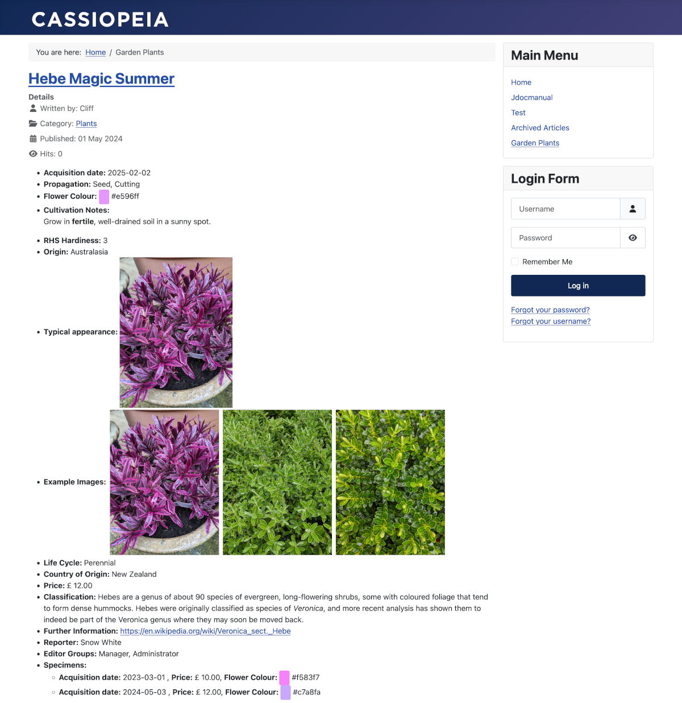

<!-- Filename: J3.x:Adding_custom_fields/Sql_Field / Display title: SQL Field -->

## Purpose

The SQL field provides a drop down list of entries obtained from a database
query. To use this field you need to know how to construct a query and you
should test it in phpMyAdmin.

## Field Creation

Special options within this field are:

- **Multiple** Allow multiple values to be selected. If set to *Yes* the list
displays 4 items. Otherwise it displays 1 item. In either case there is a long
list to scroll through to make selections - if activated.
- **Query** The SQL query which will provide the data for the dropdown list.
The query must return two columns; one called 'value' which will hold the
values of the list items; the other called 'text' containing the text
in the drop-down list.

In this example a table containing a list of country names is used. This is
the query:
```
SELECT `id` AS value, `title` AS text
FROM `#__countrybase_countries`
WHERE `state` = 1
ORDER BY `title` ASC
```


## Data Entry

Simple - select from the list.

## Data Display

The following Site screenshot shows the field displayed in an article. The
option *Automatic display* is responsible for the position of the field and
your template is responsible for the design of the field.

Look for the **Country of Origin** item.



The output is a single item or comma separated list of items (country names)
following the Field label (Country of Origin).
