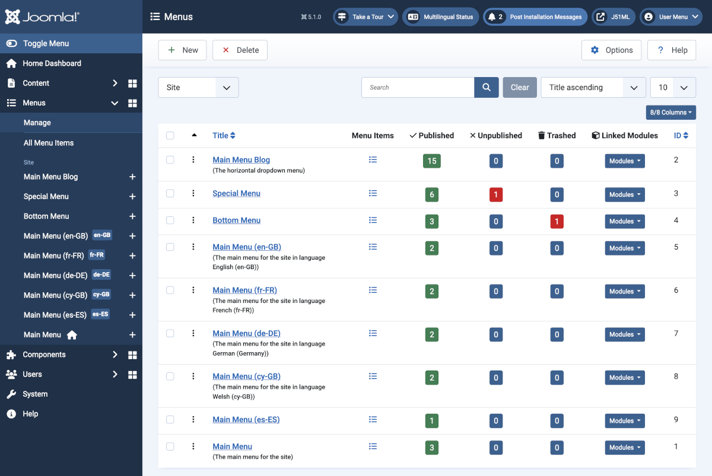
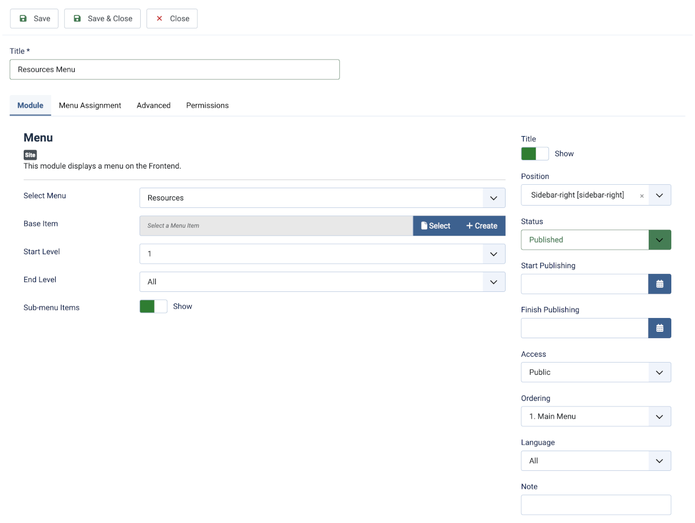
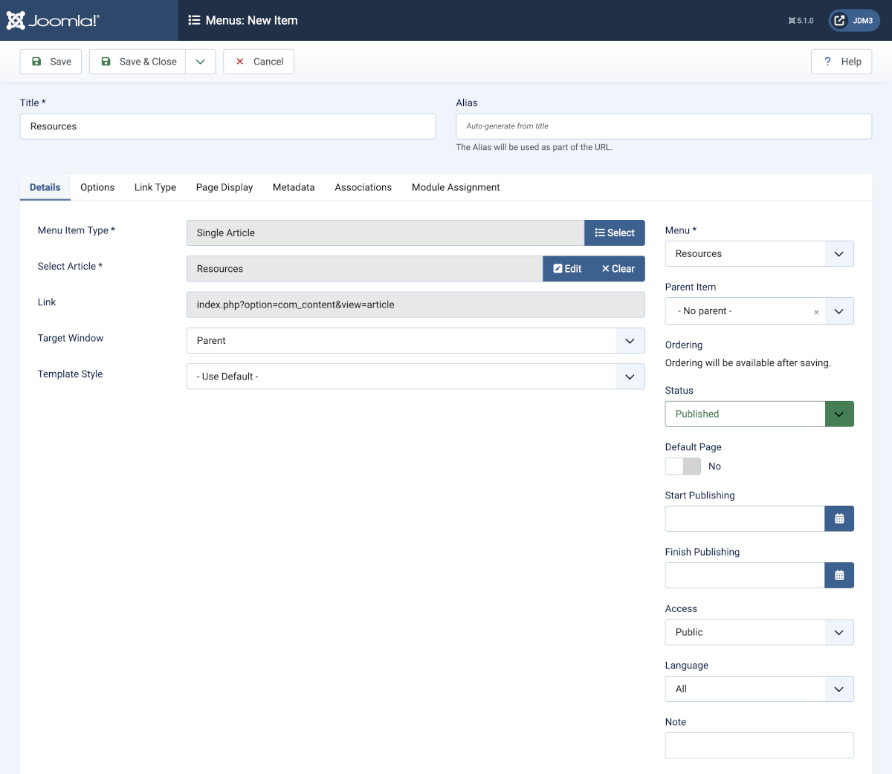
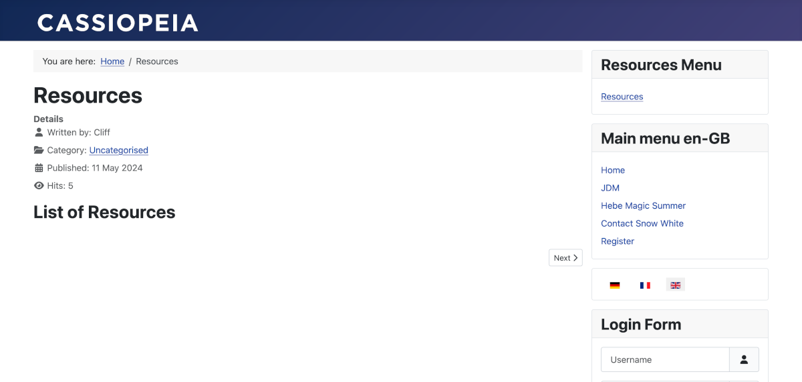

<!-- Filename: J4.x:Adding_a_New_Menu / Display title: Adding a New Menu -->

## Introduction

For content to be accessed on your Joomla! website items need to be
assigned to a Menu. A standard installation of Joomla! creates a **Main
Menu** for you. In many cases you will use only one menu but you can
have more than one. This allows you to create Menus for different types
of content, hidden content, user role specific content and more.

There are three steps in the creation of a usable menu:

1. Create the Menu. This is a container for Menu Items
2. Create a Menu Module. This allows placement of the Menu on a page.
3. Create Menu items. These are the user selectable items leading to specific
pages.

This screenshot shows the menus available in a Multilingual site. In an
initial Joomla installation there is a single *Main Menu*.

The list allows you to select any of the green or red buttons to go directly
to the list of menu items in that menu and state.

This tutorial covers the steps involved in creating a Menu in a Joomla! site.

## Create a New Menu

Use either of the following steps to create a new menu:

- From the Administrator menu select the *Menu Dashboard Icon* to be taken
to the Menu dashboard, then select **Manage**. Or...
- From the Administrator Menu expand the *Menus* section and then select
**Manage**.
- Select the  **+ New** button in the Toolbar.
- In the Menu data entry form complete the following fielss:
  - **Title**: A proper title for the menu. This is used to identify the
menu in the Menu Manager.
  - **Unique Name**: This should be a unique identification name used by
Joomla! to identify this menu. Spaces are not allowed but you may use
the '-' character such as resources-menu.
  - **Description**: Although not required this is often useful in a site with
    many menus. It appears below the *Title* in the menu list as illustrated
    above. 
    
- **Save & Close**

In the list of Menus the newly created menu has a button laballed **Add a
module for this menu**, which is the next stage in menu creation. You could
start adding menu items and come back to create the menu module later.

## Create a Module for the Menu

In the Menus list the *Linked Modules* column allows selection of any existing
menu module for editing purposes. You can have a look and then *Close* without
making any changes. For your new menu, select the **Add a module for this menu**
button to open a modal frame containing the Menu module data entry form.

Fields to complete:

* The **Title** field is required, so create a descriptive title.
* The **Show Title** button on the right is used to *Show* or *Hide* the module
title, a common feature of all modules.
* The **Select Menu** field should show the name of the Menu you just created.
* The **Position** field is used to select a position in your template where
you want your menu to appear.
* Select **Save & Close** once the essential information has been added.

There are many options to choose from in the *Edit module settings* form. They
are mentioned in the Help screen available in the *Module: Edit* form. This is
the same form but in a normal page rather than a modal frame. Access it via the
Administrator menu, Content / Site Modules route to the list of Site Modules.

Note: getting the Menu to look the way you want it to depends on your template
styling.

## Add Items to the Menu

To create the links in your menu you need to add **Menu Items**. There are many
*Menu Item Types* in Joomla and third-party components may add more types. For
this tutorial a link to a single article will be added.

You can create an article in advance or you can create an article during the
menu creation process. Either way, the article must exist before a menu item
can be created for it. In this example the article will also be named
*Resources*. It is intended to contain a list of links to PDF files.

In the **Menus** list, from the **Menu Items** column select the icon for the
newly created menu, *Resources* in this example. Initially, there are no menu
items so the list merely says *No Matching Results*.

- Select the **New** button from the Toolbar to create a new menu item.
- In the **Title** field add the title you want to appear in the Menu.
- In the **Menu Item Type** field select the **Select** button to open a modal
dialog containing a list of components. Each has a drop down list revealing.
a list of available menu item types.
  - Select **Articles** then **Single Article**.
- In the **Select Article** field: **Either:**
  - Use the **Select** button to select an existing article. It will
  open a list of articles to choose from. **Or:**
  - Use the **Create** button to create a new article. All you need to enter is
  the article title. It is probably best to leave detailed content until later.
- Check the **Menu** field is set to the new Menu.
- The **Status** field should be set to **Published**.
- Select **Save & Close**.

Add more Menu Items to the new Menu as required.

Once items have been added to the Menu check to see that the Menu is displayed
on the website in the correct position.

