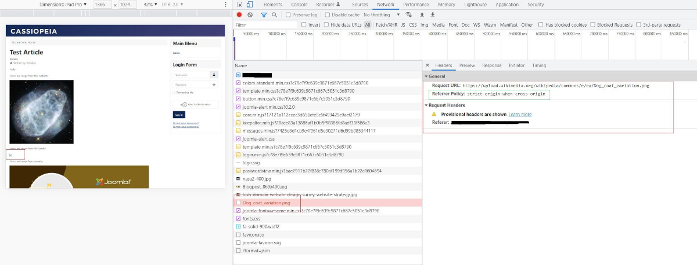
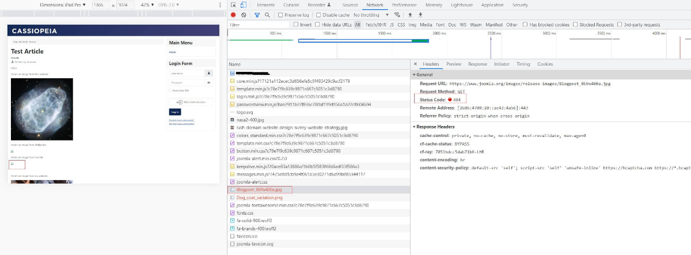
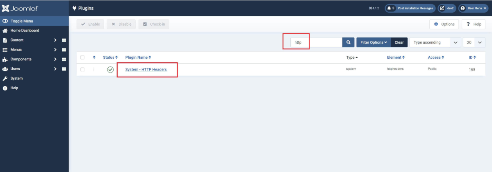
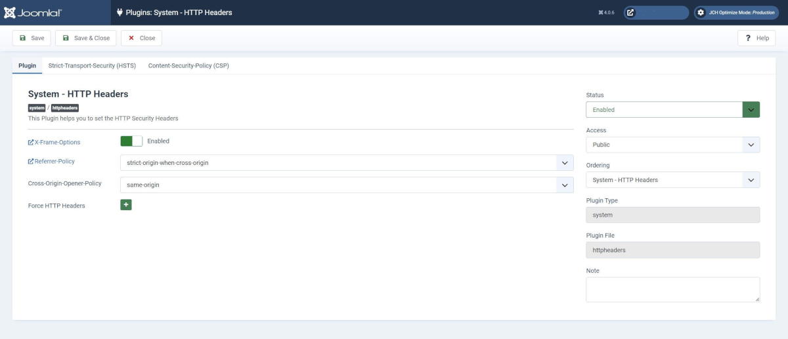
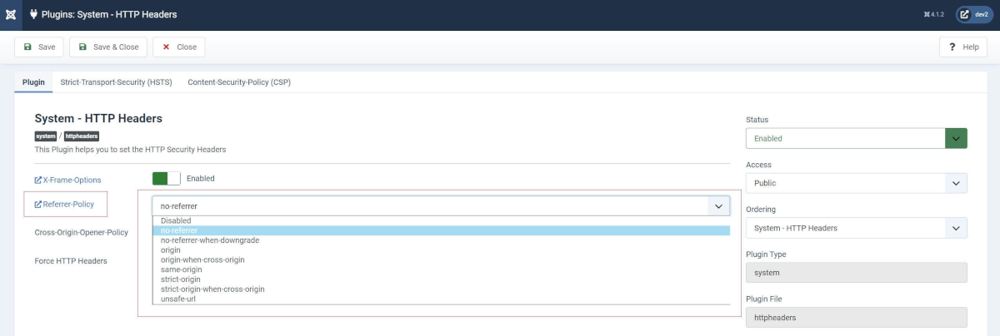
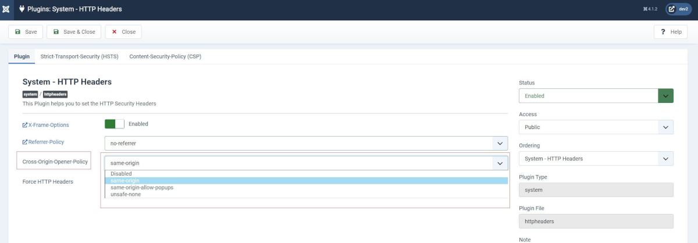
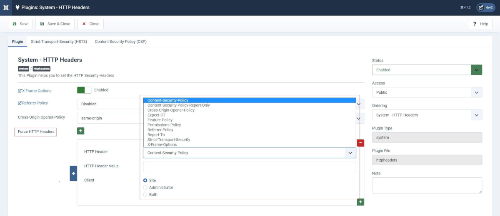
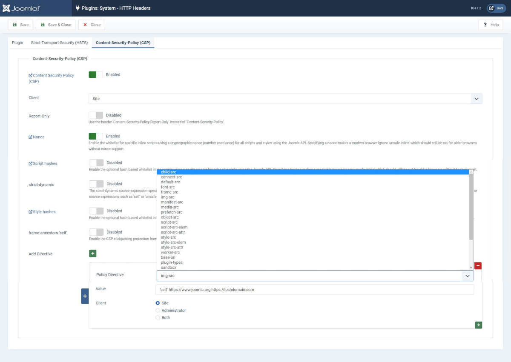
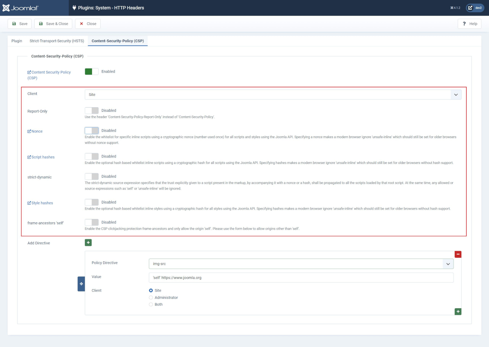
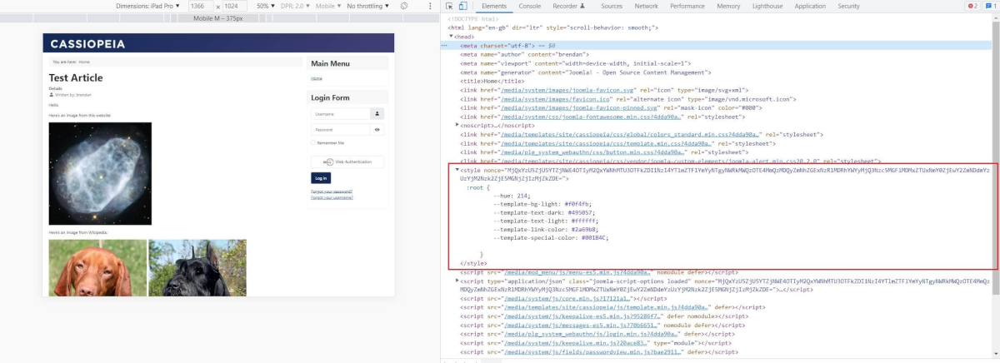

<!-- Filename: https://magazine.joomla.org/all-issues/may-2022/joomla-new-http-headers-plugin-for-j4 / Display title: HTTP Headers -->

## Magazine Article

This article is based on a Joomla! Community Magazine article by Brendan Hedges
in the [May 2022](https://magazine.joomla.org/all-issues/may-2022/joomla-new-http-headers-plugin-for-j4 "") Edition.

Although written for Joomla 4 the content applies equally to Joola 5.

## Joomla’s New HTTP Headers Plugin For J4

Following on from last month's article about security, passwords, and Joomla’s WebAuthn plugin this month, we’re going to look at another Joomla security feature that launched with J4. That is the HTTP Headers plugin which is now included as part of Joomla’s core functions.

The internet is ever developing, and Joomla’s never far behind it. Which is why I choose it as my web development platform of choice. No matter whether your website is a small Mom & Pop website, or a fully fledged Ecommerce platform with millions in sales, the Joomla framework has something for everyone, and is always looking at implementing new technologies. Some are even groundbreaking.

> The introduction of the HTTP Headers plugin in the core of Joomla 4 is a huge step forward in helping to secure your website from attack and malicious activity.

This system security plugin helps site owners easily configure the HTTP Security Headers from Joomla's familiar backend, rather than having to rummage around in the htaccess file or other configuration files. Or, even worse, your web hosting Cpanel.

Look at how complicated this is to set up in Cpanel and tell me you won't make a mistake! And, that's all assuming that once the framework's installed in Apache and directories made, you know the correct format to add the HTTP headers you want to integrate.

How many times have you tried to implement an htaccess command only to reload your website and then face a http500 error?

The single biggest problem is that if you don't get the format of your HTTP Header perfect, you'll break your site.

Even then, what works for one website may not work for another. A good example of this is my htaccess file and the way I set the browser to load a non www https version of my website:
```
##www to non www and http to https mixin
RewriteCond %{HTTPS} off [OR]
RewriteCond %{HTTP_HOST} ^www\. [NC]
RewriteRule ^ https://mywebsite.co.uk%{REQUEST_URI} [R=301,L,NE]
##End www to non www and http to https mixin
```

This worked great for my previous hosting company. But when I switched to a different host, it stopped working. Go figure!

The htaccess code I now have to use to achieve the same result looks like this:
```
##www to non www and http to https mixin
RewriteCond %{HTTP_HOST} ^www\.(.*)$ [NC]
RewriteRule ^(.*)$ https://%1/$1 [R=301,L]
RewriteCond %{ENV:HTTPS} !on
RewriteRule ^(.*)$ https://%{HTTP_HOST}%{REQUEST_URI} [R=301,L]
##End www to non www and http to https mixin
```

Confusing, right? And, if you make a single mistake in the formatting, BAM! You’ve broken your website! Well, at least until you fix your code.

Which is why keeping things simple, as part of Joomla’s core, means less frustration, less time wasted Googling your mistakes, and more time for celebration while you sit back in your chair and admire your new website.

So, let's look at what HTTP headers actually are, how you can find the plugin and what you can do with them. It’s worth mentioning here though that this Joomla function is an advanced function of Joomla, which is more suited to data sensitive websites, rather than the new website you’ve lovingly created about your cute kittens. However, in saying that, even simple websites should be as secure as possible to stop malicious code being executed after they've hacked your website.

## What are HTTP Headers?

HTTP headers are not to be confused with the &lt;head&gt; section of your HTML document. They are completely different. HTTP headers are the preamble between your web server and the browser. A set of instructions that tell the browser what, or more importantly, what not to display to the visitor.

You can see The HTTP Headers and how they pertain to individual HTML objects in your browsers DEV Tools. In Google Chrome, open the DEV Tools, then the Network tab. Now refresh the webpage and click on an HTML item in the left pane. It will display the HTTP Header for that item in the right pane.

You can see in the image below that the highlighted image is returning an HTTP status of 200, so the browser found it. There's also a range of other information linked to that item, such as file size and edit dates.


If one of your HTML items has failed to display, you may also get a clue about the reason in the HTTP headers. In this example, the second picture has failed to display and you can see from the information displayed in the right-hand pane there is no HTTP Header information.

Except the cryptic message:

**Referrer Policy:** 'strict-origin-when-cross-origin'

'Strict-origin-when-cross-origin' simply means that when an HTML item (an image in this case) is served from a different source (not your server), then the HTTP header policy set at that time must be followed. In this example the HTTP Headers, as set in the Joomla plugin, will reject all images that do not originate from either this website, or a different website that's specifically 'included' in the HTTP Header parameters set in the Joomla HTTP header plugin.

So, when the image is called from the HTML document, the browser rejects it and it's not loaded.



Which differs from not being found and returning a 404 not found HTTP error message. In this situation, the image is still being looked for on the server that hosts it, but the browser has not found it.



## What the Joomla HTTP Headers Plugin does

Apart from telling the browser what to display and returning general information about the HTML document, HTTP Headers help to mitigate attacks and security vulnerabilities you may have on your Joomla website. That's where the Joomla HTTP Headers plugin comes into its element. It achieves this by explicitly displaying HTML content based on your settings in the Joomla HTTP Headers plugin itself.

By adding extra security based HTTP headers to your Joomla website with the HTTP Header plugin you'll be providing yet another layer of security for your Joomla website.

This is important, because by default an HTML webpage will display all of its content to your visitor, good or bad. That's unless it's explicitly told not to in the web page's HTTP headers. The plugin does this by allowing you to configure the advanced security options available to you in the Content-Security-Policy for your website. the plugin can be configured differently for each website depending on your requirements, so it's a truly flexible weapon in your armoury against hackers.

## Why do I need this plugin?

In an ideal world, you wouldn't. However, in the world we live in, there are far too many unscrupulous people trying to find ways to make money from the innocent and unwary. In our world, we refer to these people as hackers. Hackers go out of their way to exploit vulnerabilities in software for monetary gain, often to the detriment of the website owner.

By using Joomla's HTTP Header plugin to control what content is being served to your visitors, you reduce the chances of hackers being able to serve malicious website content to your visitors via outdated vulnerable plugins. Which helps to stop malicious script injections on your website.

**So, let's think about this hypothetical situation for a minute.**

You have a nice Joomla 3 website. It was made 5 years ago, and it still looks and works perfectly. All of your components, plugins, and modules are up to date. Perfect, right?

Well, not quite, because when you made your website 5 years ago, you installed the trendy Foo Bar Plugin to print "FOO BAR" on your home page. It looked cool to start with, but after a while you changed your mind and deleted the plugins {foo}FOO - BAR{/bar} shortcode from your homepage article.

But, here's the issue: you did not un-publish or uninstall the plugin itself and its use faded from memory. **This is something we're ALL guilty of doing, I'm sure.**

Fast track to today, 5 years on, that plugin is still there, published and active on your website, but it's not been updated for 5 years because you've long since forgotten about the plugin, or the author stopped supporting it. Now, some nefarious fellow has realised this plugin has a security vulnerability that can be exploited to start a **Cross Site Scripting (XSS)** attack on your website, and make your unsuspecting visitors, victims.

Cross-site scripting, which is also known as XSS, is a security vulnerability in your website that allows an attacker to compromise the interactions that your users have with your now vulnerable website.

The attacker/hacker uses XSS to exploit your vulnerable website to send a malicious script to your unsuspecting user. Because the script has come from your website, your user's browser doesn't know or suspect that the script shouldn't be trusted and executes the script when the webpage loads and opens.

Malicious scripts run in this way can cause many problems for your user, from stealing login passwords and usernames data kept in cookies, to sending your user to fake phishing websites. Scripts can even change the appearance of the web page your website is serving and show you different advertising.

Using **Joomla's HTTP Headers plugin** helps to stop cross-site scripting by ensuring that only the scripts and content you want to serve to your visitor are actually served. Everything else gets blocked.

So, in the example above, you could've configured the HTTP Headers plugin to only serve your website's JavaScript (script) files from a specified folder, or maybe a CDN if you use one, to stop the attack.

You could also stop the website from running inline JavaScript that's embedded in the HTML. But, be aware that depending on how you've designed your website HTML, this could cause issues further down the line.

This would then help to stop malicious JavaScript code being executed on your website. Even if your vulnerable Foo Bar Plugin was to blame for a hacker being able to inject malicious code into your website in the first place.

**Note:**

> Common weak points on websites that are prone to XSS attacks are user input forms (user login pages, newsletter sign-up forms, contact us forms, etc.) with no validation and encryption.

## Where is the HTTP Headers Plugin?

You can find Joomla's HTTP Headers plugin along with all other Joomla plugins and it's accessed in exactly the same way that you've become accustomed to do.



## Using the HTTP Headers Plugin

Using Joomla's HTTP Plugin is relatively straightforward, although it may be a good idea before making changes to the default settings to gen-up on some of the special terms relating to its use. Although, in saying that, some of them should already be familiar to you.

**For example:**

When dealing with images, you'll see the term 'img-src', where 'img' refers to images and 'src' to the valid source of the image. These are terms we're already familiar with from basic HTML.

At the end of this article, there's a list of helpful websites with additional information to help you use this Joomla plugin.

## HTTP Headers Plugin Settings - Tab 1

When you open the plugin the first open tab is the plugin's basic settings. Here you can make adjustments to X-Frame Options, the Referrer-Policy, Cross-Origin-Opener-Policy and also Force HTTP Headers. There are also some links for more information to help you understand what these items do in more detail.

**Let's look at each of these in turn.**



### X-Frame Options

The first setting is for the X-Frame Options. **It is Enabled by default.**

This option allows you to decide if your website content can be displayed on another website in a &lt;frame&gt;, &lt;iframe&gt;, &lt;embed&gt; or &lt;object&gt;. If you disable this option, then any other website can display your website in an iframe.

Once enabled, an ‘x-frame-options: SAMEORIGIN’ tag is added to your website headers. This tag still allows you to display your own content in a &lt;frame&gt;, &lt;iframe&gt;, &lt;embed&gt; or &lt;object&gt;, on your own website. But no one else can display your content in an &lt;iframe&gt; on thier own website.


The X-Frame Option Header helps to protect your website and users from **‘Click Jacking’** attacks. This is where an attacker places an &lt;iframe&gt; on their own website and sets the source of the &lt;iframe&gt; as your website. Then the attacker uses multiple transparent layers of their own website above it.

This tricks a user into clicking on a button or link on the transparent upper layer because the user believes they are clicking on a link in the iframe below.

So, the attacker is **“hijacking”** clicks meant for the original framed page and sending them to a different webpage.

More seriously, similar practices can be used to harvest keystrokes for password and username login details from email accounts, social media accounts, and of course, your bank account.

Most modern browsers support X-Frame Options, which is great. So, my recommendation would be to enable this setting in the HTTP headers plugin to help protect your users from becoming a victim of 'Click Jacking'.

**Most modern browsers support the X-Frame Options.**


<div style="background-color: #eeffee; border: 1px solid #009900; padding: 1rem; ">
Take Away

Set this to enable. This will globally restrict what can be done with &lt;frame&gt;, &lt;iframe&gt;, &lt;embed&gt; or &lt;object&gt; on your website. To add exceptions, use ‘Force HTTP Headers’ to add granular exceptions.
</div>

### Referrer-Policy

The next item on the list in the first tab is the **Referrer-Policy**. This, if enabled, allows you to choose how much of your potential website data is transferred to another website if a link, or other HTML object, is clicked upon on your website.

Commonly, we see this set as an HTML attribute on &lt;a&gt; tags, where you might format a link as &lt;a href=”https://someplace.com” rel=”noreferrer”&gt;Click Me&lt;/a&gt;. The noreferrer tag keeps the details of the sending webpage a secret from the receiving webpage. It does this by removing the referral info from the HTTP header of the webpage.

Being aware of the data your website might ‘leak’ to another website you link to is an important part of securing your website and its users.

This is particularly so if you allow users to register, it contains sensitive data, or if your website handles monetary transactions. Joomla’s HTTP Headers plugin helps to control this on a global level, rather than on an individual link level.

By default, your website's Referrer Policy is set to ‘strict-origin-when-cross-origin’. Which doesn’t block any of the referrer data from the originating webpage unless it’s being sent to a less secure http page. But, as most web pages use https these days, this is now a bigger problem than it once was.


There are, of course, many innocent uses of this ‘leaked’ data if you do not establish a Referrer Policy for your website. These could include data collected by the linked to website for analytics, logging, or optimised caching.

Unfortunately, not every referred to website out there uses your ‘leaked’ data for such innocent operations. Take the following situation as an example.

Most websites that allow user registration will have a reset password link next to their login form on a login/register webpage. It’s also likely that the webpage will also contain other links to external websites, social media links, or maybe there’s some ‘Useful Links’ in the footer.

These all lead away from your secure environment. Now, if there’s no Referrer Policy in place, it’s possible for the Referrer Header that’s sent out to one of those external websites when a link is clicked on from that login webpage, to contain the password reset link. As well as other information you’ve shared with that external website.

This might pose a security risk to the user by compromising their data.

Because of the potential security risk on this type of data sensitive page, it’s also good practice to remove all third party content from the page. This would include all links and content delivered in &lt;iframes&gt; such as social media widgets and YouTube videos. As data entered in on this page could be sent via the Referrer Header to those sites if you click on that cute kitten video that just popped up.

Joomla’s HTTP Headers plugin addresses this issue by allowing you to choose from one of 8 Referrer Policies to establish a Referrer Policy for your website. Each with their own limits on when and how much data to share.



Let’s take a look at these. There’s an excellent description of them on the [Mozilla Headers](https://developer.mozilla.org/en-US/docs/Web/HTTP/Headers/Referrer-Policy "") page which describes them as:

* **no-referrer**<br>
    The Referrer Header will be omitted: sent requests do not include any referrer information.
* **no-referrer-when-downgrade**<br>
    Send the origin, path, and query string in the Referrer Header when the protocol security level stays the same or improves (HTTP→HTTP, HTTP→HTTPS, HTTPS→HTTPS). Don't send the Referrer Header for requests to less secure destinations (HTTPS→HTTP, HTTPS→file).
* **origin**<br>
    Send only the origin in the Referrer Header. For example, a document at https://example.com/page.html will send the referrer https://example.com/.
* **origin-when-cross-origin**<br>
    When performing a same-origin request to the same protocol level (HTTP→HTTP, HTTPS→HTTPS), send the origin, path, and query string . Send only the origin for cross origin requests and requests to less secure destinations (HTTPS→HTTP).
* **same-origin**<br>
    Send the origin, path, and query string for same-origin requests. Don't send the Referrer header for cross-origin requests.
* **strict-origin**<br>
    Send only the origin when the protocol security level stays the same (HTTPS→HTTPS). Don't send the Referrer header to less secure destinations (HTTPS→HTTP).
* **strict-origin-when-cross-origin (default)**<br>
    Send the origin, path, and query string when performing a same-origin request. For cross-origin requests send the origin (only) when the protocol security level stays the same (HTTPS→HTTPS). Don't send the Referrer header to less secure destinations (HTTPS→HTTP).
    **Note:** This is the default policy if you do not specify a policy, or if the provided value is invalid. Previously, the default was no-referrer-when-downgrade.
* **unsafe-url**<br>
    Send the origin, path, and query string when performing any request, regardless of security.
    **Warning:** This policy will leak potentially private information from HTTPS resource URLs to insecure origins. Carefully consider the impact of this setting.

<div style="background-color: #eeffee; border: 1px solid #009900; padding: 1rem; ">
Take Away

As a good start, unless there’s a reason not to do so, I’d set this to ‘no-referrer’, thus a blanket ‘share nothing’ policy for your website. Or, 'origin-when-cross-origin', which would allow you to analyse traffic on URLs within your own website (thus no data ‘leakage’), but only send your domain as the referring domain to the external website, as no ‘extra’ data from the URL will be attached to the Referral Header.
</div>

### Cross-Origin-Opener-Policy

The third option to set in the first tab is the Cross Origin Opener Policy, which is a browser-based security feature that will allow you to disconnect different **‘Browser Context Groups'** from one another.



A good example of this is the use of pop-ups. Where the original browser context group (all the text, images, links etc.) gets disconnected from a new browser context group that is created and then displayed in the pop-up.


> This HTTP Header option is quite in depth and complicated, although there are only 3 options. So I encourage you to check out the links below to get a better understanding of why this option should be set on your website. As well as learning about some of the advanced features that become available to you when this option is active.

The Cross Origin Opener Policy helps to close a historic loophole in the way browsers share data between different context groups, particularly when pop-ups are in use on the website.

Setting your **COOP** will help you mitigate data security threats, the common one is referred to as, **‘Spectre’**. Spectre makes data that’s loaded into the same browsing context group as your code potentially readable by a hacker. Spectre allows the time certain operations take to be measured. This allows those hackers to guess what’s in the CPU cache. If they’re successful at that, they will know what’s in the process memory. They then have access to your data. Which could be sensitive.

**COOP** works by isolating your original HTML document data from the HTML data that would be displayed in a pop-up from the original document. This helps to prevent what’s referred to as **cross-origin attacks, or XS-Leaks**.

This process is like the familiar rel=”noopener” that we use on regular links. But, unlike the rel=”noopener” which is only active on outgoing links, documents that have the cross-origin-opener-policy set in the HTTP headers by the Joomla plugin, restrict data in both directions. Thus, the HTML document with an active COOP policy will not have reference to it in the HTTP Header, and the window.opener HTTP Header property of the new window will be set to null.

When setting this option in the Joomla HTTP Header plugin, there are 3 options available to you.

* **unsafe-none**<br>
    This is the default value. It allows your document to be added to its opener's browsing context group unless the opener itself has a cross-origin-opener-policy of same-origin or same-origin-allow-pop-ups.
* **same-origin-allow-popups**<br>
    This option keeps references to newly opened windows or tabs that either don't set a cross-origin-opener-policy, or that opt out of isolation by setting a cross-origin-opener-policy of unsafe-none themselves.
* **same-origin**<br>
    Isolates the browsing context group only to same-origin documents. Cross-origin documents are not loaded in the same browsing context group.

<div style="background-color: #eeffee; border: 1px solid #009900; padding: 1rem; ">
Take Away

A good starting point for your website would be to leave this option in the plugin set to same-origin which is the default setting. This will allow content in your own website/domain to be loaded successfully in pop-ups, but restrict access to items from being loaded in a pop-up that originate from an external source.

As mentioned at the start of this section, certain advanced features depend on cross-origin isolation. Features like SharedArrayBuffer objects or Performance.now() methods that certain service workers need for unthrottled timers, are only available if your document has a cross-origin-opener-policy HTTP Header with the value ‘same-origin’ set.
</div>

### Force HTTP Headers

The last option to focus on in the first tab is the Force HTTP Headers, which is not to be confused with ‘Force HTTPS’ in Joomla’s general settings.



This section of the Joomla HTTP Header plugin allows you to add, if you desire, a selection of ‘other’ headers not specifically detailed in the plugin tabs, as well as force the inclusion of some that are included.

From the drop-down list, you currently have 10 options. But it’s worth noting that some of these **may be dropped over time** as the header policies they refer to are due to change, or be re-imagined.

The current HTTP headers you can directly set here are headers that target the following:

You can obtain more about each feature on the Mozilla Developers website.

#### Content-Security-Policy (list)

The Content-Security-Policy response header allows websites to control resources the user may load for each webpage. Policies mostly specify server origins and script endpoints. This helps guard against cross-site scripting attacks.
[Mozilla: Content-Security-Policy](https://developer.mozilla.org/en-US/docs/Web/HTTP/Headers/Content-Security-Policy "")

#### Content-Security-Policy-Report-Only

The HTTP Content-Security-Policy-Report-Only response header allows web developers to experiment with policies by monitoring (but not enforcing) their effects.
[Mozilla: Content-Security-Policy-Report-Only](https://developer.mozilla.org/en-US/docs/Web/HTTP/Headers/Content-Security-Policy-Report-Only "")

#### Cross-Origin-Opener-Policy (COOP)

The HTTP Cross-Origin-Opener-Policy (COOP) response header allows you to ensure a top-level document does not share a browsing context group with cross-origin documents.
[Mozilla: Cross-Origin-Opener-Policy](https://developer.mozilla.org/en-US/docs/Web/HTTP/Headers/Cross-Origin-Opener-Policy "")

COOP will process-isolate your document and potential attackers can't access your global object if they were to open it in a pop-up, preventing a set of cross-origin attacks dubbed **XS-Leaks**.

#### Expect-CT (To Be Discontinued)

The Expect-CT header lets sites opt in to reporting and/or enforcement of Certificate Transparency requirements, to prevent the use of misissued certificates for that site from going unnoticed.
[Mozilla: Expect-CT (To Be Discontinued)](https://developer.mozilla.org/en-US/docs/Web/HTTP/Headers/Expect-CT "")

#### Feature-Policy (Now Deprecated)

The HTTP Feature-Policy header provides a mechanism to allow and deny the use of browser features in its own frame, and in content within any &lt;iframe&gt; elements in the document.
[Mozilla: Feature-Policy](https://developer.mozilla.org/en-US/docs/Web/HTTP/Headers/Feature-Policy "")

#### Permissions-Policy

This is the replacement for the Feature-Policy above.
[Mozilla: Permissions-Policy (Replaces Feature Policy Above)](https://developer.mozilla.org/en-US/docs/Web/HTTP/Headers/Feature-Policy "")

#### Referrer-Policy (in list)

The Referrer-Policy HTTP header controls how much referrer information (sent with the Referrer header) should be included with requests.
[Mozilla: Referrer-Policy](https://developer.mozilla.org/en-US/docs/Web/HTTP/Headers/Referrer-Policy "")

#### Report-To

Part of the Content-Security-Policy. The Content-Security-Policy Report-To HTTP response header field instructs the user agent to store reporting endpoints for an origin.
[Mozilla: Report-To](https://developer.mozilla.org/en-US/docs/Web/HTTP/Headers/Content-Security-Policy "")

The report-to directive is intended to replace the deprecated report-uri directive, report-to is not supported in most browsers yet.

#### Strict-Transport-Security

The HTTP Strict-Transport-Security response header (often abbreviated as HSTS) informs browsers that the site should only be accessed using HTTPS, and that any future attempts to access it using HTTP should automatically be converted to HTTPS.
[Mozilla: Strict-Transport-Security](https://developer.mozilla.org/en-US/docs/Web/HTTP/Headers/Strict-Transport-Security "")

This is more secure than simply configuring a HTTP to HTTPS (301) redirect on your server, where the initial HTTP connection is still vulnerable to a man-in-the-middle attack.

#### X-Frame-Options (in list)

The X-Frame-Options HTTP response header indicates whether a browser should be allowed to render a page in a&lt;frame&gt;, &lt;iframe&gt;, &lt;embed&gt; or&lt;object&gt;, or not. Sites can use this to avoid click-jacking attacks, by ensuring that their content is not embedded into other sites.
[Mozilla: X-Frame-Options](https://developer.mozilla.org/en-US/docs/Web/HTTP/Headers/X-Frame-Options "")

The added security is provided only if the user accessing the document is using a browser that supports X-Frame-Options.

The X-Frame-Options header has child items called frame-ancestors that supersede the Frame-Options header. If a resource has both policies, the frame-ancestors policy will be enforced and the X-Frame-Options policy will be ignored.

Using the HTTP Header Value field, you can set the values you would like to be followed and assign them to your website, the admin site, or both.

<div style="background-color: #eeffee; border: 1px solid #009900; padding: 1rem; ">
Take Away

It’s worth mentioning that browser support for HTTP headers varies, so it’s a good idea before implementing your choice of HTTP Header to check its browser support for your potential audience.

If you set a series of HTTP Headers for your website and the user’s browser doesn’t support that Header option, the browser will ignore it.
</div>

## HTTP Headers Plugin Settings - TAB 2

### Strict-Transport-Security (HSTS)

**The Strict Transport Security Policy tab is disabled by default.**


I love researching. Because sometimes you come across a real OMG! Moment. This is one of those moments.

Wikipedia States:

> Netscape Communications created HTTPS in 1994 for its Netscape Navigator web browser. Originally, HTTPS was used with the SSL protocol. As SSL evolved into Transport Layer Security (TLS), HTTPS was formally specified by RFC 2818 in May 2000. Google announced in February 2018 that its Chrome browser would mark HTTP sites as "Not Secure," after July 2018. This move was to encourage website owners to implement HTTPS, as an effort to make the World Wide Web more secure.” ……

Who’d have thought Netscape invented the HTTPS protocols so long ago? What’s even more surprising is how long it took to implement it into the internet we know and love today.

For years now, they have cajoled us, bullied us, and finally threatened us, to implement HTTPS on all of our websites. Most of us capitulated and the world wide web is now finally secure. Or is it?

There are, however, some hold-outs, die-hards or forgotten about websites that are still using only http to deliver their content, albeit with a Google/Firefox etc. “This website is unsafe” warning.

A quick Google search threw up several out-of-date lists of those ‘HTTP only Guilty’ websites. Although since publishing those lists, many websites have updated to HTTPS. However, there were some obvious exclusions from organisations who you would have thought should know better.

For example:

* NGINX (http://nginx.org/)
* GNU (http://www.gnu.org/)
* The University of Washington (http://www.washington.edu/)

According to [w3techs.com](https://w3techs.com/technologies/details/ce-httpsdefault#:~:text=Default%20protocol%20https%20is%20used%20by%2079.2%25%20of%20all%20the%20websites "") about 20% of all websites are still running only on HTTP.

**So, why is this an issue?**

This is an issue because any data being sent from and received by a user's browser is at risk of being intercepted. We know this as a **man-in-the-middle attack**. Now, this may not seem an important consideration if your website is only about pictures of cute kittens.


But even simple websites can become victims of hackers and attackers who will implement **click-jacking** and other cross-origin-attacks that will harm your users.

A website that does not exchange user data, or login information, **should still use HTTPS**.

**Okay, let’s get back on topic.**

As you already know, the whole point of HTTPS is to introduce a secure connection between the user’s browser and your server. A connection whereby any exchange of data happens in a secure environment that can’t be intercepted and copied by a third party. A man in the middle.


But, did you know that unless your **HTTPS SSL Certificate** uses **TLS**, your ‘secure’ connection is not as secure as you would expect? Non TLS HTTPS connections are still **vulnerable to man-in-the-middle attacks**.

Although an old blog post, this [article](https://scotthelme.co.uk/wifi-pineapple-karma-sslstrip/ "") explains nicely how a man-in-the-middle attack works.

Browsers have [widely adopted TLS](https://caniuse.com/?search=tls "") these days, but the latest version (1.3) is not as widely supported by browsers as its predecessor (1.2).

And, TLS 1.3 is not directly compatible with previous versions unless it’s being run in [compatibility mode](https://www.ibm.com/docs/en/sdk-java-technology/8?topic=handshake-compatibility-risks-known-issues ""). Which could pose a problem for some.


Using Joomla’s HTTP Header Plugin to deal with Strict-Transport-Security (HSTS) helps to mitigate man-in-the-middle attacks by enforcing the use of TLS in your visitors web browser. TLS ensures all web communication takes place on the client side using a secure transport layer.

**Are you using a 301 redirect to serve the non-secure HTTP version of your website to the secure HTTPS version?**

Most people do. 301 redirects are instructions that most website owners setup in their htaccess file. They let Google know that the version of the website that should be used is the HTTPS (secure) one. The problem with this is that **the 301 is just a URL redirect**, so your website still does some element of the initial connection over HTTP.

Unlike connections between a user and a website server that use HSTS, where the server automatically interacts with it only using HTTPS.

HSTS has a weakness, though, as the first initial connection between the user’s browser and website server still happens over HTTP. But all subsequent connections are automatically connected via HTTPS until the HTTP Header expiry date is reached and this header is reset.

This is unlike a standard 301 redirect where every page load includes an initial http request to initiate the https connection.

There’s a solution to this weakness in the HTTP Headers HSTS settings, activate ‘Preload’.

Which will add the ‘Preload’ tag to the response header.

In the settings, [there’s also a link](https://hstspreload.org/ "") to **include your website domain in Chrome's HTTP Strict Transport Security (HSTS) preload list**. This is a list that’s hard coded into many modern browsers. The list informs the browser that the connection to example.com is only to be made via HTTPS. Thus removing the need to even make the initial connection via HTTP.


Once HSTS is set up in the Joomla HTTP header plugin, all the necessary tags are added to the HTTP Response header. This lets any users browser that’s trying to connect to your server that all connections **must be made with HTTPS**, whether specified in your HTML, or not.

In summary, using Joomla’s HTTP headers plugin to integrate HSTS instead of relying on 301 redirects to serve your content over HTTPS is an important security improvement. An improvement that helps to stop **man-in-the-middle attacks**, and provides your user with a secure environment.

HSTS covers the entire domain, unlike a 301 redirect which only covers a specific URI path.

HSTS uses a separate browser cache which is usually segregated, so it can't be easily or accidentally cleared.

HSTS can be preloaded into a browser. This ensures that a user only connects to your server with HTTPS, regardless of whether or not they've visited the site before.

<div style="background-color: #eeffee; border: 1px solid #009900; padding: 1rem; ">
Take Away

Enable: HSTS

Set max-age: The default is 1 year (31536000) seconds, but some recommend setting this to 2 years (63072000) seconds.

Enable: Subdomains - If you have subdomains, make sure you have a valid SSL certificate to cover them either individually or as a wild card from your main domain.

Enable: Preload

Lastly, submit your domain to the HSTS preload list.
</div>

## HTTP Headers Plugin Settings - TAB 3

### Content Security Policy (Tab 3)

**The Content Security Policy tab is disabled by default.**

When you enable Joomla’s Content Security Policy via the HTTP Headers plugin, you’re telling your visitor’s browser exactly what assets load from your website’s server. Which is a great way to ensure that you’re only delivering the content that you actually want to deliver.



Having an effective Content Security Policy in place is an effective way to stop **Cross-Site Scripting (XSS)**, and **Click Jacking** attacks originating from your website.

Cross-Site Scripting, otherwise known as an **XSS attack**, is an attack on your website where a malicious script is ‘injected’ into an unsuspecting and otherwise trusted website. Attackers find a weak point to exploit, which is usually where a user can input data.

Outdated components that allow user input, unvalidated comment forms, for example, could have vulnerabilities that can be exploited in a Cross Site Scripting attack. Which is why it’s a good idea to always update your Joomla components and minimise those opportunities.

**So, using the infected comments form as an example:**

Your website uses a comments form at the end of an article to gather user discussion, as many websites do. Which is great.

Your comments extension from dodgy-joomla-extensions.com works great and your users love it. But you have not updated it for 5 years and the developers have long since abandoned it.

Now, 5 years later, Mr Hacker realises that because of a vulnerability in the code for the comments component, he can hide a nasty bit of code in a comment that otherwise looks innocent.

What that code finally does varies, but what you can count on is that every time your innocent article page loads, with the comments, that bad code is also loaded and executed. It’s part of the HTML after all, and the browser doesn’t know it’s not supposed to be there, or trusted.

So, the bad code runs. Maybe it checks your cookie data. Maybe it steals sensitive data kept by the browser. Or, maybe it loads adverts from online casinos, or adult websites. Maybe it completely reloads the HTML for your innocent webpage about those cute kittens from an external JavaScript file to steal your users credit card details.

**In fact, at this point a script can be run to accomplish almost anything.**

A good Content Security Policy helps to stop this kind of attack, even if your compromised comments extension becomes the target of Mr Hacker.

It does so because the Joomla HTTP Header plugin delivers the CSP as an HTTP Response Header, **which explicitly tells the browser what to load**. In the settings of the CSP tab in the HTTP headers plugin, you can directly target **28 Policy Directives**. The directives help to secure your website by using only approved sources for your files and content.

The attack example above ended up loading a JavaScript file from a different source to change the HTML output rendered on the screen. This could have been prevented by adding the directive script-src 'self' to Joomla’s CSP in the plugin.


In this example, the browser will only load JavaScript files in the HTML document if they originate from your domain. All other JavaScript files will be rejected, including Mr Hackers.

While this helps to secure your website, it can also stop other legitimate JavaScript files you want to load as the webpage renders on the screen. These external files can be added as white listed sources in the same directive. For example, if you use bootstrap from a CDN, you would add:
```
script-src 'self' https://cdn.jsdelivr.net
```
In this example if you have trouble loading bootstrap from the CDN, https://cdn.jsdelivr.net, you could try adding the full URL to the bootstrap file you need. So, you would format your directive like this: `script-src 'self' https://cdn.jsdelivr.net/npm/bootstrap@5.1.3/dist/js/bootstrap.min.js`.


Adding these external sources would be easier to implement on a new website as you build it. But if you trawl through your rendered HTML with Dev Tools, you should be able to find all external files already being used on your established website, and include them in your CSP.

When adding directives to your Content Security Policy in the HTTP Headers Plugin, there are a **series of core values** you can use to define what should be explicitly loaded by the browser. These are the basic ones to get your first Content Security Policy set up.

Other options are available for some of the more advanced directives, a fuller list and examples of their usage can be found at the [Content Security Policy (CSP) Quick Reference Guide](https://content-security-policy.com/ "") website.

* **'none'** blocks the use of this type of resource.
* **'self'** matches the current origin (but not subdomains).
* **'unsafe-inline'** allows the use of inline JS and CSS.
* **'unsafe-eval'** allows the use of mechanisms like eval().

So, let’s take a look at some of those directives. Here is a list of some of the directives that are available in the Joomla HTTP Headers plugin, along with a brief description, [courtesy of Content Security Policy](https://content-security-policy.com/ ""). I’d recommend you visit this website for more information and examples.

<dl>
<dt>default-src</dt>
<dd>The default-src directive defines the default policy for fetching resources such as JavaScript, Images, CSS, Fonts, AJAX requests, Frames, HTML5 Media.<br>
EXAMPLE DEFAULT-SRC POLICY<br>
default-src 'self' https://cdn.example.com
</dd>
<dt>script-src</dt>
<dd>Defines valid sources of JavaScript.<br>
EXAMPLE SCRIPT-SRC POLICY<br>
script-src 'self' https://js.example.com
</dd>
<dt>style-src</dt>
<dd>Defines valid sources of stylesheets or CSS.<br>
EXAMPLE STYLE-SRC POLICY<br>
style-src 'self' css.example.com
</dd>
<dt>img-src</dt>
<dd>Defines valid sources of images.<br>
EXAMPLE IMG-SRC POLICY<br>
img-src 'self' https://img.example.com https://example.com
</dd>
<dt>connect-src</dt>
<dd>Applies to XMLHttpRequest (AJAX), WebSocket, fetch(), &lt;a ping&gt; or EventSource. If not allowed the browser emulates a 400 HTTP status code.<br>
EXAMPLE CONNECT-SRC POLICY<br>
connect-src 'self'
</dd>
<dt>font-src</dt>
<dd>Defines valid sources of font resources (loaded via @font-face).<br>
EXAMPLE FONT-SRC POLICY<br>
font-src https://font.example.com https://example.com
</dd>
<dt>object-src</dt>
<dd>Defines valid sources of plugins, eg &lt;object&gt;, &lt;embed&gt; or &lt;applet&gt;.<br>
EXAMPLE OBJECT-SRC POLICY<br>
object-src 'self'
</dd>
<dt>media-src</dt>
<dd>Defines valid sources of audio and video, eg HTML5 &lt;audio&gt;, &lt;video&gt; elements.<br>
EXAMPLE MEDIA-SRC POLICY<br>
media-src https://media.example.com
</dd>
<dt>frame-src</dt>
<dd>Defines valid sources for loading frames. In CSP Level 2 frame-src was deprecated in favour of the child-src directive. CSP Level 3, has un-deprecated frame-src and it will continue to defer to child-src if not present.<br>
EXAMPLE FRAME-SRC POLICY<br>
frame-src 'self'
</dd>
<dt>sandbox</dt>
<dd>Enables a sandbox for the requested resource similar to the iframe sandbox attribute. The sandbox applies a same origin policy, prevents pop-ups, plugins and script execution is blocked. You can keep the sandbox value empty to keep all restrictions in place, or add values: allow-forms allow-same-origin allow-scripts allow-pop-ups, allow-modals, allow-orientation-lock, allow-pointer-lock, allow-presentation, allow-popups-to-escape-sandbox, and allow-top-navigation.<br>
EXAMPLE SANDBOX POLICY<br>
sandbox allow-forms allow-scripts
</dd>
<dt>report-uri</dt>
<dd>Instructs the browser to POST reports of policy failures to this URI. You can also use Content-Security-Policy-Report-Only as the HTTP header name to instruct the browser to only send reports (does not block anything). This directive is deprecated in CSP Level 3 in favour of the report-to directive.<br>
EXAMPLE REPORT-URI<br>
report-uri /some-report-uri
</dd>
<dt>child-src</dt>
<dd>Defines valid sources for web workers and nested browsing contexts loaded using elements such as &lt;frame&gt; and &lt;iframe&gt;<br>
EXAMPLE CHILD-SRC POLICY<br>
child-src 'self'
</dd>
<dt>form-action</dt>
<dd>Defines valid sources that can be used as an HTML &lt;form&gt; action.<br>
EXAMPLE FORM-ACTION POLICY<br>
form-action 'self'
</dd>
<dt>frame-ancestors</dt>
<dd>Defines valid sources for embedding the resource using &lt;frame&gt; &lt;iframe&gt; &lt;object&gt; &lt;embed&gt; &lt;applet&gt;. Setting this directive to 'none' should be roughly equivalent to X-Frame-Options: DENY. When this directive is active, and if the browser supports it, it will override the settings in X-frame-options.<br>
EXAMPLE FRAME-ANCESTORS POLICY<br>
frame-ancestors 'none'
</dd>
<dt>plugin-types</dt>
<dd>Defines valid MIME types for plugins invoked via &lt;object&gt; and &lt;embed&gt;. To load an &lt;applet&gt; you must specify application/x-java-applet.<br>
EXAMPLE PLUGIN-TYPES POLICY<br>
plugin-types application/pdf
</dd>
<dt>base-uri</dt>
<dd>Defines a set of allowed URLs which can be used in the src attribute of a HTML base tag.<br>
EXAMPLE BASE-URI POLICY<br>
base-uri 'self'
</dd>
<dt>report-to</dt>
<dd>Defines a reporting group name defined by a Report-To HTTP response header. See the Reporting API for more info.<br>
EXAMPLE REPORT-TO DIRECTIVE<br>
report-to groupName
</dd>
<dt>worker-src</dt>
<dd>Restricts the URLs which may be loaded as a Worker, Shared Worker or Service Worker.<br>
EXAMPLE WORKER-SRC POLICY<br>
worker-src 'none'
</dd>
<dt>manifest-src</dt>
<dd>Restricts the URLs that application manifests can be loaded.<br>
EXAMPLE MANIFEST-SRC POLICY<br>
manifest-src 'none'
</dd>
<dt>prefetch-src</dt>
<dd>Defines valid sources for request prefetch and prerendering, for example via the link tag with rel="prefetch" or rel="prerender":<br>
EXAMPLE PREFETCH-SRC POLICY<br>
prefetch-src 'none'
</dd>
<dt>navigate-to</dt>
<dd>Restricts the URLs that the document may navigate to by any means. For example, when a link is clicked, a form is submitted, or window.location is invoked. If form-action is present then this directive is ignored for form submissions. Implementation Status<br>
EXAMPLE NAVIGATE-TO POLICY<br>
navigate-to https://example.com
</dd>
</dl>


Joomla’s HTTP Headers plugin also gives you the opportunity to **set some global parameters in the Content Security Policy tab**.



You can choose to apply the CSP to your website, the admin site, or both with the client setting.

The ‘Report-Only’ option lets you test out your directives and check them for errors with Dev Tools before going live. It’s always fun to track down the reason for CSP errors in Google’s console!

Next is the ‘Nonce’ setting. Nonce, meaning ‘number used once’, is a system that applies a randomly generated string to an inline &lt;script&gt; or &lt;style&gt; tag that’s included in your HTML via the Joomla API. These instances are usually implemented by third party Joomla component / module / plugin developers when you install that extra functionality to your website.

In the image below, you can see the &lt;style&gt; tag with a nonce rel attribute that has been added to the CSS &lt;styles&gt; added to my HTML document by the Akeeba Backup component.



Interestingly, the core Joomla JavaScript and CSS code that’s added to the HTML document do not currently include a ‘nonce’ tag. This is because **they are part of the ‘core’** rather than being added via the Joomla API.

If you enable the ‘Nonce’ toggle in the CSP settings, you enable those inline scripts and styles to be rendered by the browser as ‘safe’. You will also have to set the Joomla {nonce} tag in your script-src policy directive to script-src 'self' {nonce}. As a fallback for older browsers that dont support 'nonces' you can also add {script-hashes} after the {nonce} placeholder, like this script-src 'self' {nonce} {script-hashes} (pay attention to the spacing). But, don't forget to enable **Script Hashes** first.


Joomla randomly generates the ‘nonce’ text string and adds it to the &lt;style&gt; and &lt;script&gt; tags. When you enable the ‘nonce’ option in the plugins settings, the text string is passed to the HTTP Header. The browser then interprets the HTTP Header and processes the matching &lt;script&gt; or &lt;style&gt;. At the same time, it strips the Nonce text string from the rendered HTML in the browser.


This in turn, stops Mr Hacker being able to hijack the nonce text string and add it to his own injected code. Even if Mr Hacker is successful in injecting his nefarious JavaScript into your HTML, the browser will block it.

### Script Hashes

We all know that we shouldn't include inline JavaScript in our HTML, you should write it in a my-javascript.js file and added to the &lt;head&gt; or placed just before the &lt;/body&gt; tag. But we’re all guilty of doing it from time to time.

The problem is that if you do this, then add the CSP directive ‘script-src 'self'’ all inline JavaScript will be blocked by default. It’s designed to work this way to prevent Mr Hackers’ injected JavaScript being able to run on your website.

There is an override for this with the directive script-src 'unsafe-inline', which will allow Mr Hackers inline JavaScript to run, as well as your trustworthy code. This is not the best option, for obvious reasons.

**Script Hashes to the rescue!**

Joomla’s HTTP Headers plugin automatically collects all &lt;styles&gt; and &lt;scripts&gt; **passed via the Joomla API** into the site. It then generates the respective hashes and passes them via the HTTP Header. The browser then generates the hashes on the site itself and confirms that the hashes match. If they do, the scripts are executed, otherwise they are blocked.

To enable this plugin feature toggle the switch to **'Enabled'**. Then, in your script-src policy directive add the value 'self' {script-hashes}. If you're using the 'nonce' feature, as well as 'script hashes' set the directive value as in the nonce example above.


**Now, that’s clever.**

But, what’s even better is that we can use the same idea to process script hashes manually and add them to our directive script-src 'self'. It will take a little work to set up and maintain but could save your bacon if you’ve added some JavaScript to an article or custom module.

There are more detailed ways of doing this using a sha256, sha384, or sha512 hash generator. But as most people will only add small snippets of JavaScript to their article or custom module, we’ll let Google’s Dev tools do the work for us.

The process is simple. The only difference is how we generate the hash.

Assuming you have enabled the Joomla HTTP Headers plugin, CSP is active and you have the directive script-src 'self' set and saved.

Step 1 - Add your inline JavaScript to your article or custom module and save it. Don’t forget to adjust your editor settings to stop the editor stripping out your code while saving.

Step 2 - Navigate to your webpage with your script in it. Open Dev Tools and in the console tab you’ll see an error that resembles:

Refused to execute inline script because it violates the following Content Security Policy directive: "script-src 'self'". Either the 'unsafe-inline' keyword, a hash ('sha256-0Q1c1CuhLHV7WbNt+ltwJoCf3wF/O+MWqsXetkxWSm0='), or a nonce ('nonce-...') is required to enable inline execution.


Step 3 - Now, all you need to do is copy/paste the hash from the error message into your JavaScript directive in the plugin and save it again:

script-src 'self' 'sha256-0Q1c1CuhLHV7WbNt+ltwJoCf3wF/O+MWqsXetkxWSm0='


Next, reload your webpage and again check in Google’s Dev Tools. The error will now be gone and the browser will load your script on the webpage.

**Note:** There’s still an error showing in my example as the JavaScript added to my article is not complete. But, it shows that the inline code is at least trying to work.

Adding hashes to your inline code is a good way to whitelist them in the HTTP header so they will still be executed, while any inline code that’s not explicitly hashed and added to your CSP will still be blocked. Thus thwarting Mr Hackers’ attempt to compromise your website.


**Note:**

If you change your JavaScript, you’ll need to recalculate your hash and change the value in the CSP directive.

If you have problems getting your hashes to work, there are 3 common problems,
you can find solutions in the [Using a hash with CSP](https://content-security-policy.com/hash/ "")
web page.

Strict Dynamic

If you enable the Strict Dynamic option in your CSP, this will take the explicit authority that you’ve given to a script via a Hash, or Nonce, and apply it to any other script directly linked to it, or called from it. This action also overrides default directives such as 'self' or 'unsafe-inline' applied in your general CSP directives to those child scripts. They will be ignored.

Style Hashes

The CSP's Style Hash works in exactly the same way as the JavaScript hashes work above, but use this if you add CSS &lt;style&gt; blocks into your HTML body. Just as using 'Script Hashes' **enable** the plugin feature and set a style-src Policy Directive to reference it with the value 'self' {style-hashes}.


**Note:**

If you change your inline CSS, rather than CSS that's created by the Joomla API, you’ll need to recalculate your hash and change the value in the CSP directive.


 Frame Ancestors ‘self’

This option in the plugin allows a page to be framed, for example, within an iframe, but only from the same site.

If you want to explicitly allow a different website to frame your content, you can set up a specific directive ‘frame-src’.


<div style="background-color: #eeffee; border: 1px solid #009900; padding: 1rem; ">
Take Away

Sometimes A good CSP is easier to build on a new website as you build on the external resources needed.

It's important to use the full, correct base URL for the allowed domain in the CSP Directive. For example: https://www.mywebsite.co.uk, or https://www.anotherwebsite.com

It's also possible to target sub-domains with the same CSP by using wildcards. For example: https://*.example.org.

Not all browsers support all directives.

CSP supports sha256, sha384 and sha512 Hashes
</div>

## Final Note / Conclusion:

In writing this article I’ve realised that I only scratched the surface of this huge topic.

I love finding out about topics that I’ve previously otherwise ignored, or didn’t know about. Are you the same?

The conclusion that I’ve come to in researching the topic of HTTP Headers, and in particular, using Joomla’s new J4 plugin to set these, is that we all need to master this topic. There are far too many people (hackers) out there who are just waiting for an opportunity to take advantage of websites with weak security. So, don’t help your users to become victims.

Have fun investigating the Joomla HTTP headers plugin and learn how it can help to secure your website.

I recommend you do some more research into this interesting topic before you start, though. There are links below to kick start your own research. You’ll get a much better understanding of how the internet works and how your website interacts with it.

### For Reference

If you need to reset the plugin the HTTP Headers plugin was intalled with the following options set:

The plugin is Enabled by default.

* The HSTS and CSP tabs are Disabled by default.
* The X-Frame-Options are Enabled by default.
* The Referrer-Policy is initially set to: strict-origin-when-cross-origin.
* The Cross-Origin-Opener-Policy is initially set to same-origin.

If you’ve read this far and thought “That’s not fair, what about J3?”, “Why can’t we have the same features in Joomla 3?”. Well, the good news is, you can. Although you’ll have to [download the plugin from the [JED](https://extensions.joomla.org/extension/httpheader ""), and install it. The J3 plugin comes with most of the same features as the J4 version, and it’s written by the same team that’s behind the J4 version which is now included in the core :).

When you’ve set up your HTTP headers with the Joomla 4 plugin, you can test
your HTTP Headers at the [Security Headers](https://securityheaders.com/) web
site.

How did you score?

Be aware that activation of the HTTP Headers plugin may have [unexpected actions](https://developer.mozilla.org/en-US/docs/Web/HTTP/Headers/Content-Security-Policy/script-src "") on the front end.

Finally, I'd like to thank Tobias Zulauf & Ced Keiflin for their input in getting this article finished in time!
<!--
### More Reading:

Here are some of the webpages I used to research this article, they are full of useful information on this topic.

* https://docs.joomla.org/J4.x:Http_Header_Management
* https://csp.withgoogle.com/docs/index.html
* https://content-security-policy.com/
* https://scotthelme.co.uk/content-security-policy-an-introduction/
* https://scotthelme.co.uk/csp-cheat-sheet/
* https://support.cpanel.net/hc/en-us/articles/1500001533562-How-to-add-nosniif-CORS-HSTS-Clickjack-and-X-Xss-Protection-headers-on-a-per-domain-basis
* https://developer.mozilla.org/en-US/docs/Web/HTTP/Headers/Referrer-Policy
* https://developer.mozilla.org/en-US/docs/Web/Security/Referer_header:_privacy_and_security_concerns
* https://developer.mozilla.org/en-US/docs/Web/HTTP/Headers/Cross-Origin-Opener-Policy
* https://web.dev/why-coop-coep/
* https://en.wikipedia.org/wiki/Spectre_(security_vulnerability)
* https://developer.mozilla.org/en-US/docs/Web/JavaScript/Reference/Global_Objects/SharedArrayBuffer
* https://developer.mozilla.org/en-US/docs/Web/API/Performance/now
* https://www.troyhunt.com/clickjack-attack-hidden-threat-right-in/
* https://scotthelme.co.uk/hsts-the-missing-link-in-tls/
* https://scotthelme.co.uk/wifi-pineapple-karma-sslstrip/
* https://help.upguard.com/en/articles/4581202-what-s-the-difference-between-using-hsts-and-doing-a-301-redirect
* https://content-security-policy.com/hash/
* https://content-security-policy.com/frame-ancestors/
* https://content-security-policy.com/nonce/

Computer icons created by Freepik - Flaticon

Server icons created by Freepik - Flaticon

German translation of this article: https://www.jug-zueri.ch/artikel/das-http-headers-plugin-in-joomla-4

Russian translation of this article, part 1: https://habr.com/ru/articles/697214/

Russian translation of this article, part 2: https://habr.com/ru/articles/704778/
->